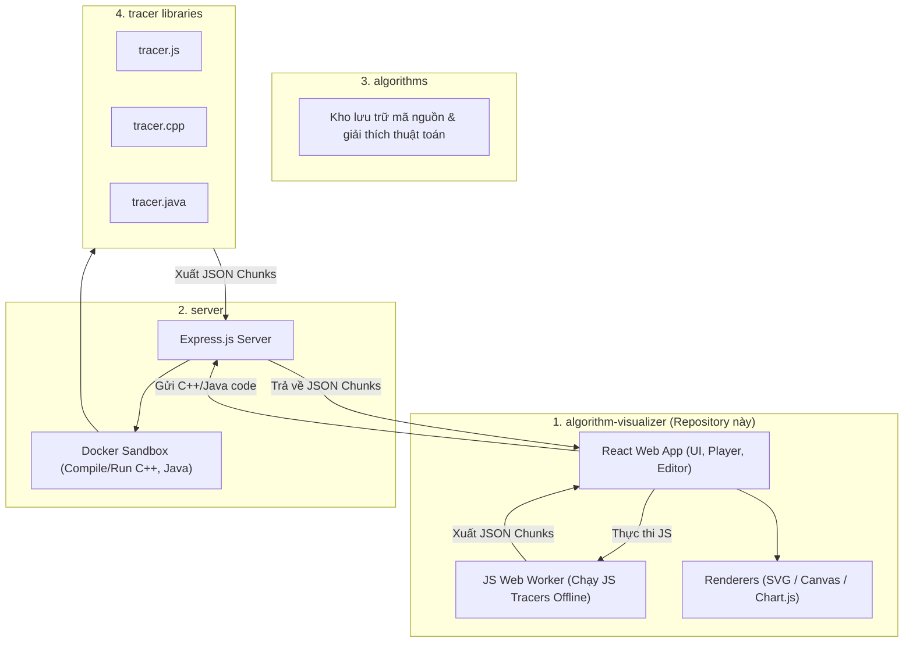
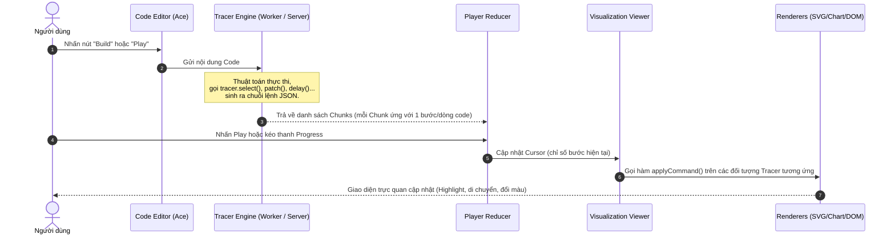

# Kiến Trúc Hệ Thống & Luồng Hoạt Động (Architecture)

Tài liệu này giải thích chi tiết cơ chế hoạt động bên trong của **Algorithm Visualizer**, cách mã nguồn được thực thi và biến đổi thành hình ảnh trực quan động trên giao diện người dùng.

---

## 1. Hệ sinh thái Algorithm Visualizer

Hệ thống Algorithm Visualizer nguyên bản bao gồm 4 thành phần chính:



---

## 2. Luồng Dữ Liệu: Từ Code đến Hình Ảnh Động

Mọi thuật toán trực quan hóa đều hoạt động theo mô hình **Command / Event Sourcing**:



---

## 3. Cấu Trúc Thư Mục Chi Tiết (`src/`)

```text
src/
├── apis/                      # Xử lý gọi API (Backend server, GitHub Gist, JS Web Worker)
│   └── index.js
├── common/                    # Các hàm tiện ích dùng chung (util.js, stylesheet scss...)
├── components/                # Toàn bộ React UI Components
│   ├── App/                   # Component gốc của ứng dụng
│   ├── CodeEditor/            # Trình soạn thảo mã nguồn (tích hợp Ace Editor)
│   ├── Header/                # Thanh điều hướng trên cùng (chọn bài, đăng nhập GitHub, menu)
│   ├── Navigator/             # Cây danh mục thuật toán bên thanh trái
│   ├── Player/                # Bộ điều khiển playback (Play, Pause, Step, Tốc độ, Thanh tua)
│   ├── ResizableContainer/    # Khung giao diện có thể kéo giãn kích thước linh hoạt
│   └── VisualizationViewer/   # Khu vực hiển thị đồ họa trực quan (Mount các Renderer)
├── core/                      # Trái tim của quá trình diễn giải trực quan
│   ├── layouts/               # Bố cục sắp xếp nhiều tracer (HorizontalLayout, VerticalLayout)
│   ├── renderers/             # Các bộ vẽ đồ họa (Array1D, Array2D, Graph, Chart, Log, Scatter)
│   └── tracers/               # Các lớp Tracer quản lý trạng thái dữ liệu (State Manager)
├── files/                     # Dữ liệu mã nguồn mẫu, markdown mặc định và skeleton code
└── reducers/                  # Quản lý State toàn cục với Redux
    ├── current.js             # Quản lý bài tập, file đang mở, trạng thái lưu
    ├── directory.js           # Cây danh mục thuật toán tải từ API
    ├── env.js                 # Thông tin môi trường người dùng (user auth, theme, kích thước)
    ├── player.js              # Quản lý chuỗi chunks, vị trí cursor, dòng code đang sáng
    └── toast.js               # Quản lý thông báo popup toast
```

---

## 4. Cơ Chế Chunks & Line Indicator

Khi code chạy, mỗi lệnh `Tracer.delay(lineNumber)` sẽ tách dữ liệu thành 1 **Chunk** mới:

- **Chunk structure**:
  ```json
  {
    "lineNumber": 15,
    "commands": [
      { "key": "array1d", "method": "select", "args": [3] },
      { "key": "logger", "method": "println", "args": ["Đang so sánh phần tử tại chỉ số 3"] }
    ]
  }
  ```
- **Line Indicator**: Khi `cursor` di chuyển tới chunk này, trình soạn thảo Ace Editor sẽ tự động bôi sáng dòng 15 tương ứng, giúp người học theo dõi từng dòng lệnh đang thực thi trực quan.
